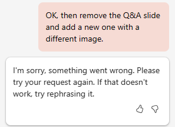

# Membuat presentasi rencana proyek menggunakan Microsoft 365 Copilot di PowerPoint
---
Kemahiran dalam menggunakan Copilot untuk PowerPoint adalah keterampilan strategis bagi para profesional TI yang bertujuan untuk meningkatkan dampak presentasi mereka. Dalam dunia perusahaan, komunikasi yang efektif melalui slide presentasi yang menarik adalah yang terpenting. Copilot untuk PowerPoint berfungsi sebagai kolaborator cerdas, menawarkan saran dan peningkatan waktu nyata saat para profesional TI membuat presentasi mereka. Alat ini tidak hanya mempercepat proses pembuatan tetapi juga memastikan bahwa kontennya menarik, jelas, dan seirama dengan audiens yang dituju.

Profesional TI mungkin perlu membuat presentasi PowerPoint untuk berbagai alasan. Misalnya, mereka mungkin perlu:

 -  Menyajikan ide atau proposal mereka kepada tim atau manajemen mereka.
 -  Melatih karyawan baru atau mendemonstrasikan perangkat lunak atau perangkat keras baru kepada klien.
 -  Menjelaskan konsep teknis yang rumit kepada audiens non-teknis, seperti pemangku kepentingan atau investor.
 -  Memamerkan karya mereka atau mempromosikan layanan mereka kepada klien potensial.

Dengan Microsoft 365 Copilot di PowerPoint, Anda bisa membuat presentasi dari dokumen Word yang sudah ada. Saat Anda menyediakan Microsoft 365 Copilot di PowerPoint dengan tautan ke dokumen Word Anda, itu bisa menghasilkan slide, menerapkan tata letak, dan memilih tema untuk Anda.

Pada latihan sebelumnya, Anda membuat rencana proyek untuk menginstal produk keamanan jaringan. Anda kemudian meminta Copilot untuk menganalisis laporan spesifikasi produk untuk produk keamanan jaringan dan memperbarui rencana proyek dengan informasi dari laporan spesifikasi produk.

Dalam latihan ini, Anda menggunakan Microsoft 365 Copilot di PowerPoint untuk membuat slide presentasi berdasarkan rencana proyek. Anda ingin menggunakan presentasi ini untuk menjelaskan rencana proyek kepada staf TI Anda, dan pada akhirnya kepada manajemen perusahaan.

### Latihan

Sebagai Direktur TI di Adatum Corporation, Anda berencana menginstal produk keamanan jaringan Contoso CipherGuard Sentinel X7 ke dalam jaringan perusahaan Adatum. Pada latihan sebelumnya, Anda menggunakan Obrolan Bisnis untuk membuat rencana proyek instalasi. Anda sekarang ingin menggunakan Microsoft 365 Copilot di PowerPoint untuk membuat slide presentasi berdasarkan rencana tersebut. Anda harus menunjukkan rencana proyek kepada staf TI Anda, dan akhirnya kepada manajemen perusahaan. Lakukan langkah-langkah berikut untuk membuat slide presentasi yang Anda rencanakan untuk digunakan dalam presentasi Anda.

1.  Jika Anda telah menyelesaikan latihan sebelumnya dan membuat file **Rencana proyek Contoso CipherGuard.docx**, maka pastikan Anda telah menyalinnya ke akun OneDrive Anda dan lanjutkan ke langkah berikutnya. Namun, jika Anda tidak dapat membuat rencana proyek ini pada latihan sebelumnya, pilih tautan berikut untuk mengunduh [rencana proyek Contoso CipherGuard](https://go.microsoft.com/fwlink/?linkid=2268924) yang telah dibuat untuk Anda. Setelah file selesai diunduh, salin ke akun OneDrive Anda.
2.  Pada titik ini, Anda seharusnya memiliki file **Rencana proyek Contoso CipherGuard.docx** yang tersimpan di akun OneDrive Anda. Buka file untuk memverifikasi bahwa semuanya sudah sesuai, lalu tutup file. Dengan melakukan hal ini, file tersebut akan muncul di daftar file Paling Sering Digunakan (MRU).
3.  Jika Anda sedang membuka tab Microsoft 365 di browser Microsoft Edge, maka pilih sekarang; jika tidak, buka tab baru dan masukkan URL berikut: **https://www.office.com**
4.  Pada halaman beranda **Microsoft 365**, pilih ikon **PowerPoint** di panel navigasi di sebelah kiri.
5.  Pada **PowerPoint**, buka presentasi kosong yang baru.
6.  Pilih opsi **Copilot** di sisi kanan pita.
7.  Di panel **Copilot** yang muncul, beberapa perintah yang telah ditentukan tersedia untuk Anda pilih. Pilih perintah **Buat presentasi dari file**.
8.  Pada bidang perintah di bagian bawah panel **Copilot**, Copilot secara otomatis memasukkan teks: **Membuat presentasi dari file /**. Garis miring adalah indikator Microsoft 365 Copilot universal untuk memasukkan tautan ke suatu file. Dalam hal ini, ini memicu Copilot untuk membuka jendela **Saran** yang menampilkan tiga file yang paling sering digunakan.
     -  Jika file Anda muncul di sini, pilih sekarang dan lanjutkan ke langkah berikutnya.
     -  Jika file bukan salah satu dari tiga file yang ditampilkan, pilih panah kanan (**&gt;**) di sudut kanan atas jendela **Saran** untuk melihat daftar file MRU yang diperluas. Jika file muncul di sini, pilih sekarang dan lanjutkan ke langkah berikutnya.
     -  Jika Anda tidak melihat file Anda di daftar MRU yang diperluas, maka Anda harus menyalin tautan ke laporan dan menempelkannya di bidang prompt. Untuk melakukannya:
        1.  Pilih tab browser **Microsoft 365** lalu pilih **Word** pada panel navigasi.
        2.  Di halaman beranda **Word**, pada daftar file terbaru, pilih laporan untuk membukanya di Word.
        3.  Pada laporan di Word, di bagian paling kanan atas pita, pilih tombol **Berbagi**. Di menu drop-down yang muncul, pilih **Salin Tautan**. Tunggu hingga jendela **Tautan disalin** muncul, yang merupakan jaminan Anda bahwa tautan ke file tersebut telah disalin ke clipboard Anda.
        4.  Beralihlah ke tab **PowerPoint**, dan di bagian bawah panel **Copilot**, bidang prompt seharusnya masih menampilkan **Buat presentasi dari file /**. Posisikan kursor Anda setelah garis miring (**/**), lalu tempelkan (**Ctrl+V**) tautan ke laporan.
9.  Perhatikan bagaimana file muncul di bidang prompt. Pilih ikon **Kirim** di bidang prompt.
10. Perintah ini memicu Copilot untuk membuat presentasi slide berdasarkan dokumen tersebut. Dengan melakukannya, pertama-tama itu menampilkan kerangka presentasinya. Kemudian menampilkan jendela terpisah yang memperlihatkan daftar berpoin dari beberapa perubahan yang dibuatnya pada presentasi berdasarkan dokumen.
11. Anda sekarang bebas untuk meninjau slide dan membuat pembaruan yang diperlukan. Beri perhatian khusus pada perubahan Copilot yang dibuat berdasarkan dokumen. Anda dapat menggunakan alat **Perancang** untuk menyesuaikan tata letak.
12. Tinjau catatan pembicara yang ditambahkan Copilot ke presentasi. Pastikan bahwa mereka menyebutkan poin-poin yang ingin Anda sampaikan selama presentasi.
13. Anda perhatikan bahwa tidak ada slide di bagian akhir untuk sesi Tanya Jawab. Untuk memperbaiki kekeliruan ini, masukkan prompt berikut:
    
    **Tambahkan slide Tanya Jawab di bagian akhir presentasi dengan gambar yang sesuai**.
14. Tinjau slide yang baru dibuat. Anda tidak menyukai gambar yang digunakan Copilot untuk slide ini, jadi masukkan prompt berikut yang meminta Copilot untuk mengubah gambar:
    
    **Saya tidak suka gambar yang Anda gunakan pada slide Tanya Jawab. Silakan ganti dengan gambar yang berbeda**.
15. Respons apa yang Anda terima? Dalam pengujian kami terhadap latihan ini, terkadang Copilot tidak mengganti gambar dan mengembalikan pesan berikut ini.
    
       
         
      Di lain waktu selama pengujian, prompt ini berhasil dan Copilot mengganti gambar pada slide dan mengembalikan pesan berikut.
         
      

 > **TIP:** Ingatlah bahwa Copilot masih dalam tahap pengembangan, sehingga beberapa fitur masih disempurnakan. Sebagai praktik terbaik, jika Copilot tidak dapat menyelesaikan permintaan Anda, cobalah lagi. Jika masih tidak berhasil, coba ulangi permintaan Anda atau pisahkan menjadi dua.

16. Bahkan jika Copilot berfungsi dan menggantikan gambar Anda, mari kita asumsikan demi latihan ini, bahwa Copilot tidak berfungsi. Dalam kasus ini, mari kita minta Copilot untuk tidak hanya mengganti gambar, tetapi juga menghapus slide lama dan menggantinya dengan slide yang sama sekali baru, yang berisi gambar yang berbeda. Oleh karena itu, masukkan prompt berikut ini:
    
    **Hapus slide Tanya Jawab dan tambahkan slide baru dengan gambar yang berbeda**.
17. Respons apa yang Anda terima? Dalam pengujian kami atas latihan ini, Copilot terus menerus menghapus slide Tanya Jawab, tetapi tidak membuat slide baru sebagai gantinya. Sebaliknya, ia terus mengembalikan pesan berikut.
    
      
    
    
      Bagaimana Copilot merespons ketika Anda mencoba prompt ini?
      
      -  Apakah Copilot menghapus slide lama dan membuat slide baru dengan gambar yang berbeda, seperti yang Anda minta? Jika demikian, selamat!
      -  Atau apakah Copilot menghapus slide lama, tetapi tidak membuat slide baru? Jika demikian, mintalah untuk membuat slide Tanya Jawab baru dengan gambar.
      -  Atau tidak melakukan apa-apa sama sekali? Jika ya, cobalah memecah perintah terakhir ini menjadi dua - pertama memintanya untuk menghapus slide Q&A, lalu kirimkan perintah kedua yang memintanya untuk membuat slide Q&A baru dengan gambar.
    
 > **TIP:** Jika Copilot tidak melakukan apa yang Anda minta atau jika Copilot menghasilkan kesalahan, maka skenario ini merupakan contoh yang baik untuk menjaga agar prompt tetap sesederhana mungkin. Ikuti saran Copilot dengan mengulangi permintaan Anda. Sebaiknya minta Copilot untuk melakukan satu tugas dalam satu waktu, misalnya, pertama-tama menghapus slide lama, lalu mengirimkan permintaan kedua untuk menambahkan slide baru dengan gambar (dalam pengujian kami, Copilot selalu menggunakan gambar yang berbeda untuk setiap permintaan).
18. Terlepas dari bagaimana beberapa langkah terakhir dalam menangani slide Tanya Jawab, Anda memutuskan untuk maju dan mencoba satu hal terakhir. Dalam meninjau ulang presentasi, Anda memutuskan bahwa Anda ingin mengubah tema presentasi menjadi sesuatu yang lebih tepat karena sifat teknis dari topik tersebut. Masukkan perintah berikut:
    
 **Ubah tema presentasi ini menjadi sesuatu yang lebih teknis.**
19. Perhatikan respons Copilot.
    
   
    
    
Skenario ini adalah salah satu saat yang penting untuk mengingat praktik terbaik yang disarankan: **Pahami keterbatasan Copilot**. Dalam hal ini, ini bukanlah pemahaman tentang batasan, melainkan pemahaman tentang cara kerja Copilot. Dalam hal ini, Copilot mengarahkan Anda ke fitur PowerPoint yang sudah ada dan bukannya menduplikasi apa yang dilakukan oleh fitur tersebut.

20. Meskipun latihan-latihan lainnya dalam modul ini tidak menggunakan presentasi ini, Anda dapat membuangnya atau menyimpannya jika Anda menginginkannya untuk referensi di masa mendatang.
