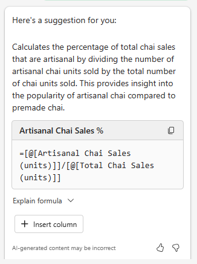
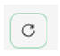

# Menganalisis lembar bentang tren pasar menggunakan Microsoft 365 Copilot di Excel
---
Para profesional Pemasaran dapat menggunakan Microsoft 365 Copilot di Excel untuk menganalisis data mereka dan mendapatkan wawasan tentang bisnis mereka. Microsoft 365 Copilot di Excel adalah alat canggih yang dapat membantu para profesional Pemasaran membuat, mengedit, memahami, dan memvisualisasikan data mereka dengan mudah.

Misalnya, mereka dapat menggunakan Microsoft 365 Copilot di Excel untuk menganalisis hasil bisnis triwulanan, meringkas tren utama, menerapkan kode warna pada tabel, membuat model, skenario, memfilter dan mengurutkan, dan menambahkan bagan hanya dengan mengklik mouse. Kemampuan yang didukung AI Copilot dapat membantu profesional Pemasaran menghemat waktu dan upaya dengan mengotomatiskan tugas berulang dan memberikan wawasan berharga yang dapat membantu mereka membuat keputusan yang tepat. Dengan menggunakan Microsoft 365 Copilot di Excel, mereka dapat fokus pada hal yang paling penting, yaitu tujuan dan sasaran bisnis mereka.

Microsoft 365 Copilot di Excel adalah alat yang sangat berharga dalam kotak peralatan profesional Pemasaran. Alat ini memberikan banyak manfaat, termasuk:

 -  **Menyorot, memfilter, dan mengurutkan data dengan mudah**: Microsoft 365 Copilot di Excel dapat membantu para profesional Pemasaran dengan cepat mengidentifikasi dan mengatur data dengan menyorot, memfilter, dan mengurutkannya. Misalnya, profesional Pemasaran dapat menggunakan Copilot untuk memfilter data yang tidak relevan dari himpunan data besar, seperti demografi pelanggan, dan fokus pada data yang paling relevan dengan tujuan pemasaran mereka.
 -  **Menghasilkan saran kolom rumus untuk perhitungan yang kompleks**: Microsoft 365 Copilot di Excel dapat membantu para profesional Pemasaran menghasilkan saran kolom rumus untuk perhitungan yang rumit, seperti menghitung laba atas investasi (ROI) kampanye pemasaran mereka. Misalnya, seorang profesional Pemasaran dapat menggunakan Copilot untuk menghitung ROI kampanye pemasaran email mereka dengan membagi pendapatan yang dihasilkan oleh kampanye tersebut dengan biaya kampanye.
 -  **Membantu analisis, pemahaman, dan visualisasi data**: Microsoft 365 Copilot di Excel dapat membantu para profesional Pemasaran menganalisis, memahami, dan memvisualisasikan data mereka dengan menggunakan kekuatan AI. Misalnya, seorang profesional Pemasaran dapat menggunakan Copilot untuk mengidentifikasi tren dalam data penjualan mereka dan menggunakan wawasan ini untuk membuat keputusan yang tepat tentang strategi pemasaran mereka.

Saat Anda menggunakan Salinan Microsoft 365 di Excel, Anda harus memiliki tabel Excel yang menyertakan data dalam lembar kerja. Anda bisa dengan cepat mengubah rentang sel menjadi tabel Excel dengan mengikuti langkah-langkah berikut:

1.  Pilih sel atau rentang dalam data.
2.  Pilih **Beranda**&gt;**Format sebagai Tabel**.
3.  Dalam kotak dialog **Format sebagai Tabel**, pilih kotak centang di samping **Tabel saya memiliki header** jika Anda ingin baris pertama rentang menjadi baris header.
4.  Pilih **OK**.

Dalam latihan ini, Anda menggunakan Microsoft 365 Copilot di Excel untuk menganalisis lembar bentang tren pasar yang sudah memiliki tabel Excel yang telah ditentukan. Latihan ini menguji banyak fungsi dan prompt bawaan Copilot. 

### Latihan

Sebagai Direktur Pemasaran Contoso Beverage, sebuah divisi dari Contoso, Ltd, Anda menerima lembar bentang tren pasar yang menunjukkan aktivitas bulanan untuk produk Teh Chai Contoso pada tahun 2023. Anda ingin menggunakan fitur Microsoft 365 Copilot di Excel untuk menganalisis laporan dan memberikan analisis terperinci tentang tren pemasaran bulanan pada tahun 2023. Dalam latihan ini, Anda akan meninjau berbagai prompt dan fitur yang telah ditentukan yang disediakan Microsoft 365 Copilot di Excel.

Lakukan langkah-langkah berikut untuk menganalisis lembar bentang tren pasar menggunakan Microsoft 365 Copilot di Excel:

1.  Jika Anda mengunduh lembar bentang [Tren pasar Teh Chai Contoso 2023](https://go.microsoft.com/fwlink/?linkid=2268822) di latihan sebelumnya, lanjutkan ke langkah berikutnya. Jika tidak, pilih tautan untuk mengunduh file, pindahkan ke akun OneDrive Anda, lalu buka dan tutup file tersebut untuk memasukkannya ke dalam daftar file Paling Sering Digunakan (MRU).
2.  Jika Anda sedang membuka tab Microsoft 365 di browser Microsoft Edge, maka pilih sekarang; jika tidak, buka tab baru dan masukkan URL berikut: **https://www.office.com**
3.  Pada beranda **Microsoft 365** , pilih ikon **Excel** di panel navigasi di sebelah kiri.
4.  Di **Excel**, pada halaman **File**, pilih **Tren pasar Teh Chai Contoso 2023.xlsx** dari daftar file.
5.  Pilih opsi **Copilot** di sisi kanan pita.
6.  Di panel **Copilot** yang muncul, beberapa perintah yang telah ditentukan tersedia untuk Anda pilih. Pilih tombol **Tampilkan wawasan data**.
    
  
    
7.  Perhatikan bagan pivot yang dihasilkannya. Saat kami menguji latihan ini, Copilot selalu membuat grafik garis **Keterlibatan Media Sosial (tampilan) berdasarkan Tanggal**. Jenis bagan apa yang dibuat Copilot untuk Anda? Di bawah bagan yang dibuat Copilot untuk Anda, pilih tombol **+Tambahkan ke lembar baru**.
8.  Pilih **Lembar 2**. Tinjau lembar data baru yang dibuat Copilot. Microsoft 365 Copilot menyertakan grafik dan kolom data dari lembar bentang yang menjadi dasar grafik ini. Tahan kursor Anda di atas bagan dan perhatikan jendela yang muncul yang mengindikasikan jenis bagan yang dibuat oleh Copilot.
9.  Perhatikan, bahwa pada panel Copilot, daftar prompt yang sudah ditetapkan sebelumnya, tidak lagi muncul. Situasi ini terjadi karena Copilot belum bekerja pada PivotTables (perhatikan pesan yang menunjukkan masalah ini). Pilih **Lembar 1**, yang akan mengembalikan Anda ke tabel Excel. Perhatikan bagaimana prompt yang telah ditentukan sebelumnya muncul.
10. Pada prompt yang sudah ditentukan yang muncul di atas bidang prompt, pilih tombol **Tampilkan saran untuk kolom rumus**.
11. Perhatikan saran yang disediakan Copilot. Gambar berikut menunjukkan saran yang diberikan Copilot selama pengujian kami.
    
   
    
12. Pada saran yang Anda terima, pilih panah drop-down **Jelaskan rumus**. Tinjau penjelasan Copilot yang menjelaskan tentang perhitungannya. Pilih tombol **+Sisipkan Kolom** untuk menyisipkan kolom ini ke dalam tabel Excel Anda.
13. Perhatikan bagaimana Copilot menambahkan kolom data ini ke akhir tabel Excel Anda di **Lembar 1**. Fitur ini membuat Anda penasaran, jadi Anda sekarang ingin melihat saran rumus lain yang disediakannya. Pilih tombol **Tampilkan saran untuk kolom rumus** sekali lagi. Perhatikan sarannya. Pilih tombol **+Sisipkan Kolom** untuk menyisipkan kolom yang disarankan ini ke dalam tabel Excel Anda.
14. Pada perintah yang sudah ditentukan yang muncul di atas bidang perintah, pilih tombol **Bagaimana cara menyorot, memfilter, dan mengurutkan data**?
15. Perhatikan daftar tindakan yang dapat Anda lakukan.
16. Tinjau daftar prompt yang telah ditentukan sebelumnya yang sekarang muncul. Gambar berikut ini menunjukkan contoh prompt yang kami terima dalam pengujian kami.
    
   
    
17. Tujuan dari latihan ini adalah untuk merasakan berbagai jenis tindakan yang telah ditentukan sebelumnya yang dapat dilakukan oleh Copilot. Oleh karena itu, pilih prompt yang berbeda untuk melihat apa yang terjadi. Contohnya:
     -  Jika muncul prompt **Urutkan**, pilih sekarang. Perhatikan bagaimana Copilot mengurutkan data untuk Anda.
     -  Jika muncul prompt **Tebalkan**, pilih sekarang. Perhatikan bagaimana Copilot menebalkan item dalam kolom yang disebutkannya dan membiarkan yang lain tidak ditebalkan.
     -  Jika muncul prompt **Sorot**, pilih sekarang. Perhatikan respons Copilot dan bagaimana ia menyoroti data dalam tabel.
18. Pada titik ini, prompt yang telah ditetapkan sebelumnya yang ditampilkan Copilot tidak lagi menarik bagi Anda. Dengan demikian, Anda ingin melihat serangkaian prompt baru. Pilih tombol **Refresh** yang muncul di atas bidang prompt.
    
   
    
    
19. Tinjau serangkaian prompt baru yang ditampilkan. Pilih tombol **Refresh** beberapa kali untuk melihat berbagai jenis prompt yang disediakan Copilot.
20. Jangan ragu untuk memilih prompt lain untuk melihat apa yang dilakukan Copilot. Setelah selesai, tutup tab browser Microsoft Edge Anda.
